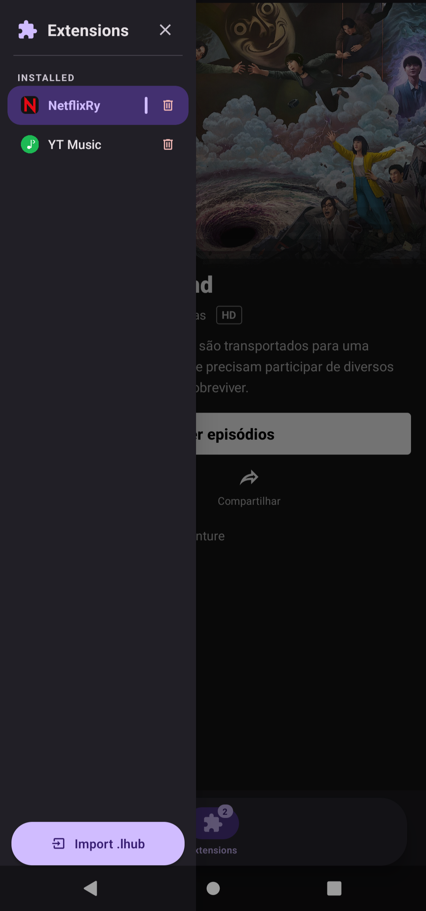
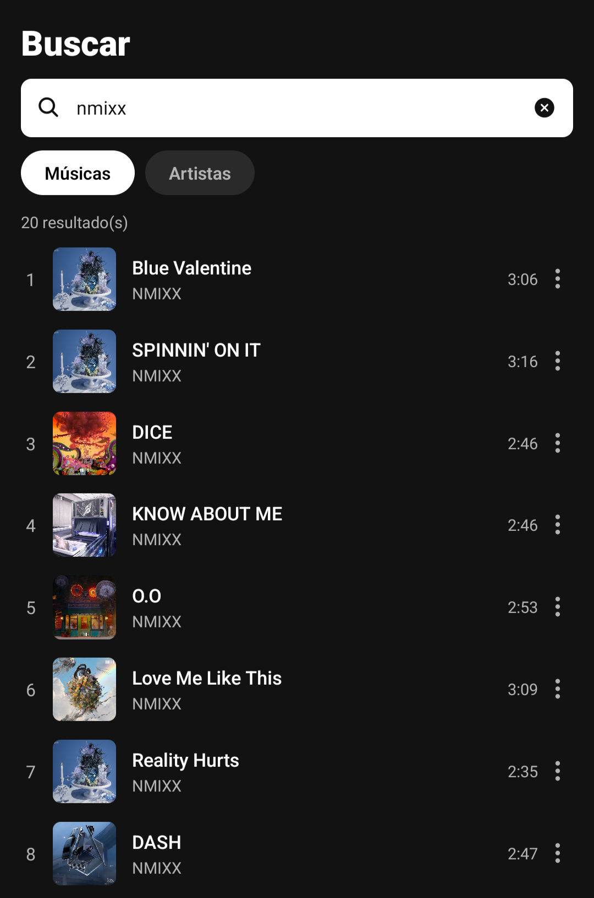
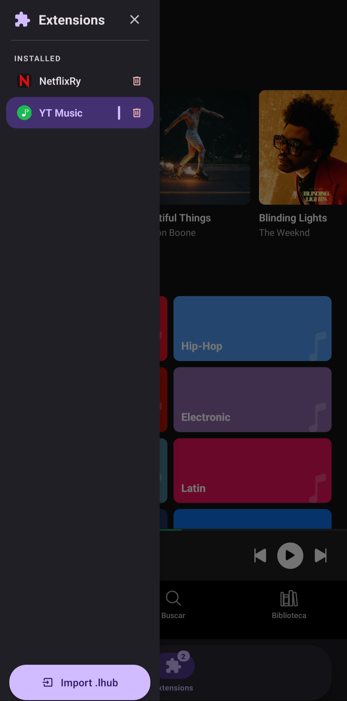
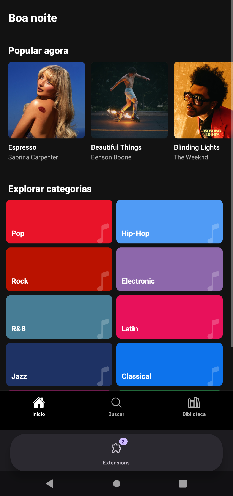
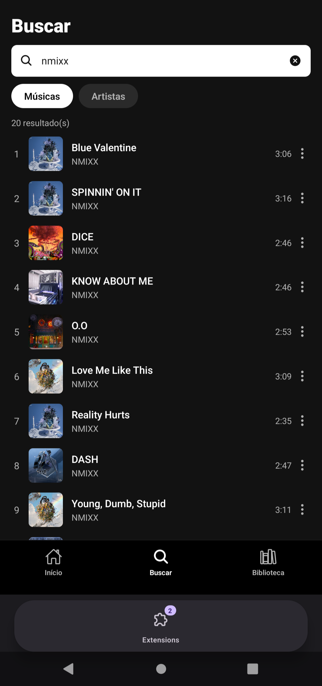

<div align="center">


# Lighter Hub

**A modular, extension-powered media platform built with React Native & Expo.**  
Install `.lhub` extensions and unlock infinite content providers — movies, series, music and more.

<div style="display: flex;">
    
    
</div>
<div style="display: flex;">
    
    
    
</div>


[](https://reactnative.dev)
[](https://expo.dev)
[](https://www.typescriptlang.org)
[](LICENSE)

</div>

---

## What is Lighter Hub?

Lighter Hub is a **media aggregator shell** — a beautiful, performant host app that does one thing brilliantly: run community-built extensions. Think of it like a browser for media content, where each extension is a fully self-contained provider with its own UI, navigation, and API integrations.

Extensions are distributed as `.lhub` files (lightweight zip bundles), installed on the fly, and sandboxed inside the app. No rebuilds, no store updates — just plug and play.

---

## Architecture

```
Lighter Hub (Host App)
│
├── ExtensionContext       — installs, persists & sandboxes extensions
├── ExtensionNavigator     — animated stack navigator for each extension tab
├── MediaPlayerContext     — fullscreen video player + music notification API
│
└── .lhub Extension Bundle
    ├── main.js            — extension logic (sandboxed eval)
    └── icon.png           — tab icon
```

The host app exposes a rich **Sandbox API** to extensions — React, React Native primitives, Expo AV, AsyncStorage, animation libraries, icons, and both media player APIs — all injected at runtime without the extension needing any dependencies of its own.

---

## 🔌 The `.lhub` Extension Format

A `.lhub` file is simply a **zip archive** with two files:

```
my-extension.lhub
├── main.js       ← Extension code (CommonJS, sandboxed)
└── icon.png      ← Icon shown in the tab bar (optional)
```

`main.js` receives the full Sandbox API as arguments and must export a manifest via `module.exports`.

---

## 🛠️ Extension Template

Here's a minimal but fully functional `.lhub` extension template:

```js
// main.js — Lighter Hub Extension Template
// Available globals injected by the host (no imports needed):
//
// React, useState, useEffect, useCallback, useMemo, useRef
// View, Text, ScrollView, FlatList, Image, TouchableOpacity,
// Pressable, TextInput, ActivityIndicator, StyleSheet,
// Dimensions, Platform, Linking, Alert, useColorScheme
// Animated, useSharedValue, useAnimatedStyle, withSpring, withTiming
// MaterialCommunityIcons, Ionicons, FontAwesome
// AsyncStorage, fetch, console
// musicPlayer    — lock-screen / notification player API
// videoPlayer    — fullscreen video player API
// WebView        — for embed-based players

module.exports = {
  id:          'com.yourname.myextension',   // unique reverse-domain ID
  name:        'My Extension',
  version:     '1.0.0',
  description: 'Does something awesome',

  // ─── Tabs ────────────────────────────────────────────────────────────────
  // Each tab appears as an icon in the bottom navigation while active.
  tabs: [
    {
      id:        'home',
      label:     'Home',
      icon:      'home-outline',       // MaterialCommunityIcons name
      iconActive: 'home',

      // ─── Root screen ───────────────────────────────────────────────────
      component: function HomeScreen({ navigation }) {
        var items = [
          { id: '1', title: 'Item One',   uri: 'https://example.com/stream1.mp4' },
          { id: '2', title: 'Item Two',   uri: 'https://example.com/stream2.mp4' },
        ];

        var styles = StyleSheet.create({
          container: { flex: 1, backgroundColor: '#0f0f0f', padding: 16 },
          header:    { color: '#fff', fontSize: 24, fontWeight: '700', marginBottom: 16 },
          card:      { backgroundColor: '#1e1e1e', borderRadius: 12, padding: 16, marginBottom: 12 },
          cardTitle: { color: '#fff', fontSize: 16, fontWeight: '600' },
          cardSub:   { color: '#888', fontSize: 13, marginTop: 4 },
        });

        return React.createElement(ScrollView, { style: styles.container },
          React.createElement(Text, { style: styles.header }, 'My Extension'),
          ...items.map(function(item) {
            return React.createElement(
              TouchableOpacity,
              {
                key: item.id,
                style: styles.card,
                onPress: function() {
                  // Navigate to detail screen, passing data as params
                  navigation.push('detail', { item: item, _title: item.title });
                }
              },
              React.createElement(Text, { style: styles.cardTitle }, item.title),
              React.createElement(Text, { style: styles.cardSub }, 'Tap to watch'),
            );
          })
        );
      },

      // ─── Sub-screens ───────────────────────────────────────────────────
      // Reached via navigation.push('screenName', params)
      // The host renders them with an animated slide + auto back button.
      screens: {
        detail: function DetailScreen({ navigation, params }) {
          var item = params.item;

          var styles = StyleSheet.create({
            container: { flex: 1, backgroundColor: '#0f0f0f', alignItems: 'center', justifyContent: 'center', padding: 24 },
            title:     { color: '#fff', fontSize: 22, fontWeight: '700', marginBottom: 24 },
            btn:       { backgroundColor: '#6750A4', paddingVertical: 14, paddingHorizontal: 32, borderRadius: 12 },
            btnText:   { color: '#fff', fontSize: 16, fontWeight: '600' },
          });

          function handlePlay() {
            videoPlayer.open({
              uri:   item.uri,
              title: item.title,
              // Optional: render your own controls overlay
              renderControls: function(api) {
                return React.createElement(
                  TouchableOpacity,
                  { onPress: api.togglePlay, style: { position: 'absolute', bottom: 40, alignSelf: 'center' } },
                  React.createElement(
                    MaterialCommunityIcons,
                    { name: api.isPlaying ? 'pause-circle' : 'play-circle', size: 64, color: '#fff' }
                  )
                );
              },
            });
          }

          return React.createElement(View, { style: styles.container },
            React.createElement(Text, { style: styles.title }, item.title),
            React.createElement(
              TouchableOpacity, { style: styles.btn, onPress: handlePlay },
              React.createElement(Text, { style: styles.btnText }, '▶  Watch Now')
            )
          );
        },
      },
    },

    // ─── Second tab example ──────────────────────────────────────────────
    {
      id:    'search',
      label: 'Search',
      icon:  'magnify',

      component: function SearchScreen({ navigation }) {
        var query = useState('')[0];
        var setQuery = useState('')[1];

        var styles = StyleSheet.create({
          container: { flex: 1, backgroundColor: '#0f0f0f', padding: 16 },
          input: {
            backgroundColor: '#1e1e1e', color: '#fff', borderRadius: 10,
            paddingHorizontal: 16, paddingVertical: 12, fontSize: 15,
          },
        });

        return React.createElement(View, { style: styles.container },
          React.createElement(TextInput, {
            style: styles.input,
            placeholder: 'Search...',
            placeholderTextColor: '#555',
            value: query,
            onChangeText: setQuery,
          })
        );
      },
    },
  ],
};
```

> **Tip:** Use the `musicPlayer` API to show a lock-screen notification when playing audio:
> ```js
> musicPlayer.update({ title: 'Song Name', artist: 'Artist', isPlaying: true, duration: 240, position: 30 });
> musicPlayer.setHandlers({ onPlay: resume, onPause: pause, onNext: next, onPrev: prev });
> ```

---

## 📦 Building a `.lhub` File

```bash
# Place your main.js and icon.png in a folder, then zip:
zip -j my-extension.lhub main.js icon.png
```

That's it. Send the file to a device, open Lighter Hub, and install it.

---

## 🎬 Example Extension: MegaFlix

The repo includes **NetflixRy × MegaFlix** as a real-world reference extension — a Netflix-styled UI powered by TMDB metadata with streams resolved from MegaFlix, complete with:

- Trending / popular carousels
- Movie & series detail screens
- Season & episode selectors
- Fullscreen video player with custom controls
- CORS proxy fallback for web

Study it as a production example of everything the extension API can do.

---

## 🚀 Running the Host App

```bash
git clone https://github.com/yourname/lighter-hub.git
cd lighter-hub
npm install
npx expo start
```

Scan the QR code with Expo Go, or run on a simulator:

```bash
npx expo run:ios
npx expo run:android
```

---

## 📋 Extension Sandbox API Reference

| Category | Available |
|---|---|
| **React** | `React`, `useState`, `useEffect`, `useCallback`, `useMemo`, `useRef`, `useContext`, `createContext` |
| **Layout** | `View`, `ScrollView`, `FlatList`, `Text`, `Image`, `ActivityIndicator` |
| **Input** | `TextInput`, `TouchableOpacity`, `Pressable`, `PanResponder` |
| **Styling** | `StyleSheet`, `Dimensions`, `useColorScheme`, `Platform` |
| **Animation** | `Animated`, `useSharedValue`, `useAnimatedStyle`, `withSpring`, `withTiming`, `withSequence`, `interpolate` |
| **Icons** | `MaterialCommunityIcons`, `Ionicons`, `FontAwesome` |
| **Storage** | `AsyncStorage` |
| **Network** | `fetch`, `WebView` |
| **Media** | `Audio` (expo-av), `musicPlayer`, `videoPlayer` |
| **System** | `Linking`, `Alert`, `StatusBar`, `console` |

---

## 🤝 Contributing

Extensions are the heart of Lighter Hub. To contribute:

1. Fork the repo
2. Build your `.lhub` extension using the template above
3. Open a PR with your extension in `/extensions/`

---

## 📄 License

MIT © Lighter Hub Contributors
